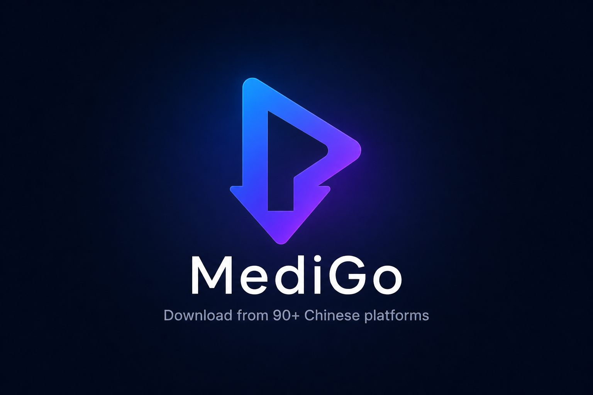

<p align="center">
  
</p>

<p align="center">
  <strong>Download videos from 90+ Chinese educational platforms. Single binary, cross-platform.</strong>
</p>

<p align="center">
  <a href="#install">Install</a> •
  <a href="#usage">Usage</a> •
  <a href="#supported-platforms">Platforms</a> •
  <a href="#contributing">Contributing</a>
</p>

---

## Install

```bash
# Go install (requires Go 1.25+)
go install github.com/nichuanfang/medigo/cmd/medigo@latest

# Or download binary from releases
# https://github.com/nichuanfang/medigo/releases
```

### Build from source

```bash
git clone https://github.com/nichuanfang/medigo.git
cd medigo && make build
```

### Optional dependencies

- **ffmpeg** — required for HLS/DASH streams and format merging

## Usage

```bash
# Download a video
medigo https://www.bilibili.com/video/BV1GJ411x7h7

# With cookies (for paid/locked content)
medigo --cookies cookies.txt URL

# Read cookies from browser
medigo --cookies-from-browser chrome URL

# List available formats
medigo -F URL

# Dump info as JSON (no download)
medigo -j URL

# Simulate (show info without downloading)
medigo --simulate URL

# Download entire course/playlist
medigo --yes-playlist --cookies cookies.txt URL

# Custom output template
medigo -o "%(site)s/%(title)s.%(ext)s" URL

# With proxy
medigo --proxy socks5://127.0.0.1:1080 URL

# Concurrent fragment downloads
medigo -N 20 URL
```

## Options

```
General:
  -h, --help                      show help
      --version                   show version
      --list-extractors           list all supported sites
      --simulate                  show extracted info without downloading

Download:
  -f, --format STRING             format selection (best/worst/1080p/720p/480p)
  -o, --output STRING             output filename template (default "%(title)s.%(ext)s")
  -N, --concurrent-fragments INT  concurrent fragment downloads (default 10)
      --no-overwrites             skip existing files
      --yes-playlist              download all items in a playlist/course
      --merge-output-format STR   output container for merged streams (mp4/mkv/webm)
      --no-progress               suppress progress bar
      --proxy STRING              HTTP/SOCKS5 proxy URL

Authentication:
      --cookies STRING            Netscape cookie file path
      --cookies-from-browser STR  read cookies from browser (chrome/edge/firefox)

Output:
  -F, --list-formats              list available formats and exit
  -j, --dump-json                 dump info JSON to stdout
      --write-info-json           write .info.json file alongside download
      --write-subs                write subtitle files alongside download
```

## Output template

The `-o` flag supports these variables:

| Variable | Description |
|----------|-------------|
| `%(title)s` | Video/course title |
| `%(ext)s` | File extension |
| `%(site)s` | Site name |
| `%(artist)s` | Uploader/author |
| `%(quality)s` | Selected quality |

## Supported platforms

<details>
<summary><strong>103 extractors across 92 sites</strong> (click to expand)</summary>

Bilibili (video/cheese/gongfang/bangumi), Douyin, CCTV, Chaoxing, iCourse163 (mooc/app/youdao/textbook), Xuetang, Zhihuishu (course/live/school/smart), iMOOC, DingTalk, Feishu, Fenbi, Huatu, Gaodun, Jianshe99, Med66, Hqwx, Wangxiao, Wangxiao233, Dongao, Eoffcn, Kaoyanvip, Yikaobang, Xueersi, Yangcong, Yixiaoerguo, Speiyou, Gaotu, Koolearn, Cto51, Huke88, Magedu, Itbaizhan, Luffycity, Tmooc, Mashibing, Xiaoetech, Xiaoeapp, Youzan, Qlchat, Lizhiweike, Renrenjiang, Sanjieke, Duanshu, Lexueyun, Meeting, Classin, CCTalk, Baijiayunxiao, Keqq, Smartedu, Icourses, ICVE (ai/mooc/course/profession/v2/qun/weike/material), Cnmooc, Open163, Unipus, Ahu, Nmkjxy, Aishangke, Caixuetang, Chaoge, Ckjr, Enetedu, Gongxuanwang, Haiyangknow, Haozaixian, Houda, Houdu, Htknow, Jinbangshidai, Jingtongxue, Kaimingzhixue, Kuke, Ledu, Mddclass, Minshi, Orangevip, Plaso, Qihang, Shanxiang, Sier, Wallstreets, Wendao, Wowtiku, Xiwang, Xsteach, Xuelang, Yizhiknow, Youdao, Youyuan, Zhaozhao, Zhengbao, Zlketang

</details>

## Architecture

```
medigo URL
  → extractor.Match(url)           # URL pattern → select extractor
  → extractor.Extract(url, opts)   # API chain → MediaInfo
  → download.SelectBestStream()    # format selection
  → engine.Download(info, stream)  # HLS/DASH/direct with retry + cancel
```

- `internal/extractor/<site>/` — per-site extractors
- `internal/extractor/shared/` — platform helpers (CSSLCloud, Polyv, BokeCC, Baijiayun, Aliyun VOD)
- `internal/download/` — download engine (HLS master+variant, DASH mux, concurrent segments, AES-128)
- `internal/cookie/` — Netscape file + browser cookie extraction
- `internal/util/` — HTTP client with retry, crypto (AES/RSA/MD5/SHA1)

## Development

```bash
make build          # build binary
make test           # run tests
go vet ./...        # static analysis

# Verify source alignment
python3 scripts/verify_source_alignment.py
```

## Contributing

Pull requests welcome. Please ensure `go build ./...`, `go vet ./...`, and `go test ./...` pass before submitting.

## License

[The Unlicense](LICENSE) — released into the public domain.
